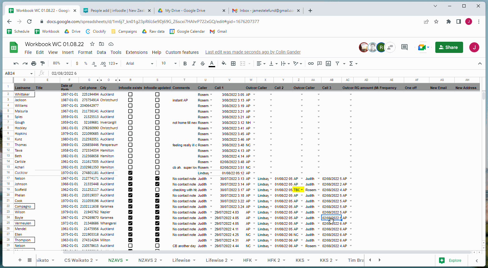

# NZAVS_Infoodle_Automation

These instructions are not as exhaustive as previous ones but do still provide enough information to get you up and running.
Like always if any assistance is required please get in contact with me.

Installation is like the previous ahk scripts I have made.

There is a first time setup. It will ask you to click locations on the screen. This is where it will press the buttons that it needs to press to automate the processes. After this it will ask you what your template message will be and this will be added the start of notes execpt when it is the 3rd attempt no contact.

Normal usage will invole a simple greeting message confirming that you want to carry on using the same settings as previous times. If you want to change any of these you can press no and follow the prompts as you wish.

Here is a gif of me following the prompts and setting it up with the correct locations:

## Actions

**General comments**
All actions must be started on the workbook.

Some of the actions will require user input. Checking of accounts require you to say yes or no. All of the others simply require you to confirm that things have loaded. For these if you dont do anything for long enough it will carry on anyway. You can press enter on the keyboard instead of pressing with mouse as it will be quicker.

Infoodle must be in the tab to the right of the workbook.

### RAlt 
This will search infoodle for the leads account. If found will add template note if not will create new account.  
The particular row you are using **does not** matter.  
Here is a demonstration of using it for a person who has an account:

### RAlt + L 
For use with third calls and no contacts.  
It will search infoodle for the account. If it exists then it will automatically add note and fill out the workbook accordingly. If the account does not exist then it will create a infoolde account.

You must be on the call date column of final attempt as the particular row you are using **does** matter

Here is a demonstration of it being used with an account:

