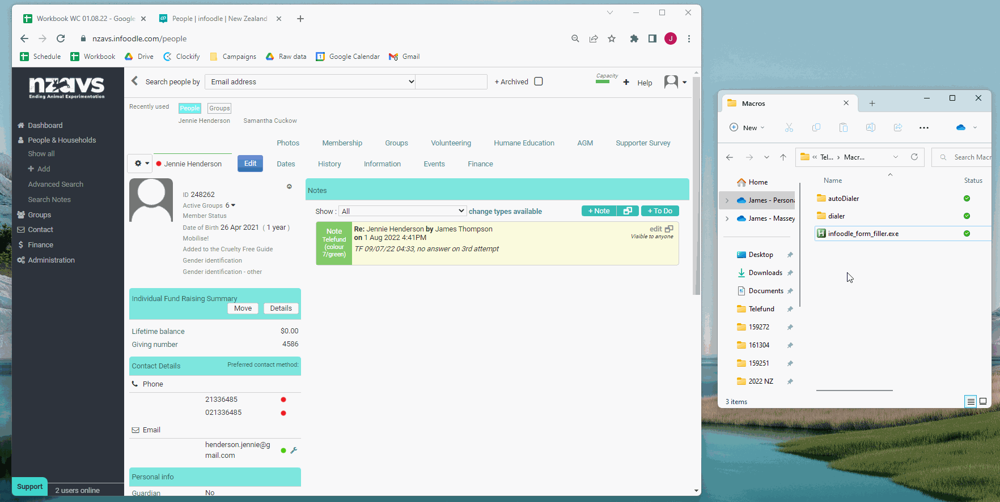
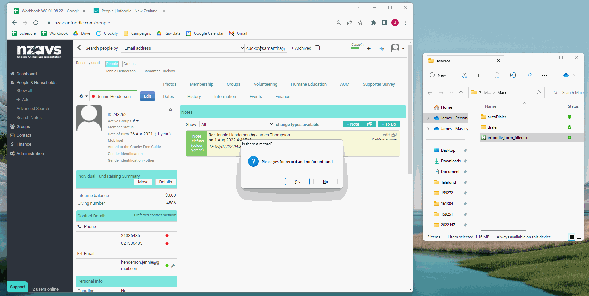

# NZAVS_Infoodle_Automation

This read me is to be completed at a later date simple informaiton is being put in here so you can atleast understand what it does without reading code.

Installation is like the previous ahk scripts i have made.

There is no first setup.

Setup at the start of each shift is a bit more involed. You have to 'train' the script where your button are.
It will come up with prompts and you follow them. It is going to remember the exact place on your screen so if you move you window around then you 
will need to redo it.

Here is a gif of me following the propmpts and setting it up:

Actions

 - **RAlt** This will search infoodle for an account. 
   - If it does have an account it will add then template of a note.
   - If there is no account it will start the process of creating an account.
Here is a demonstration of template note:

 - **RAlt** + **L** This will do the process for a third call attempt with either creating an account or leaving a note.
